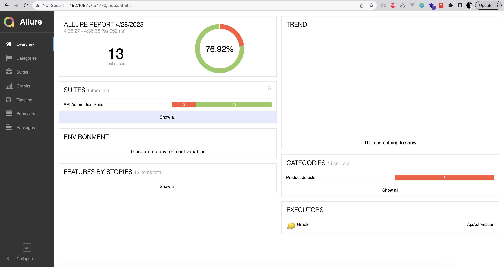
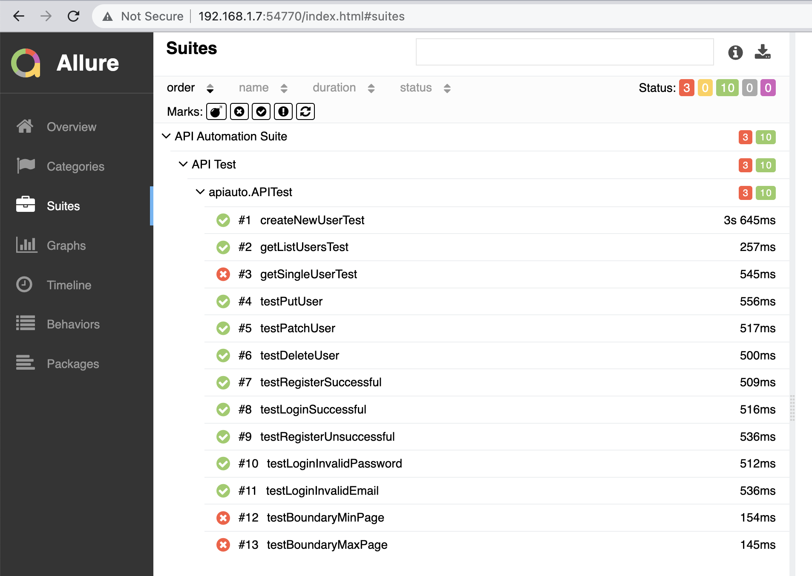

### API Automation Test Framework

Objective task pada project ini adalah untuk melakukan automation task pada api https://reqres.in.
Framework testing yang digunakan adalah TestNG, HTTP client library menggunakan Rest-Assured, dan report menggunakan Allure.

Terdapat sebanyak 13 test yang dilakukan. Hasil report menggunakan Allure adalah sebagai berikut:

